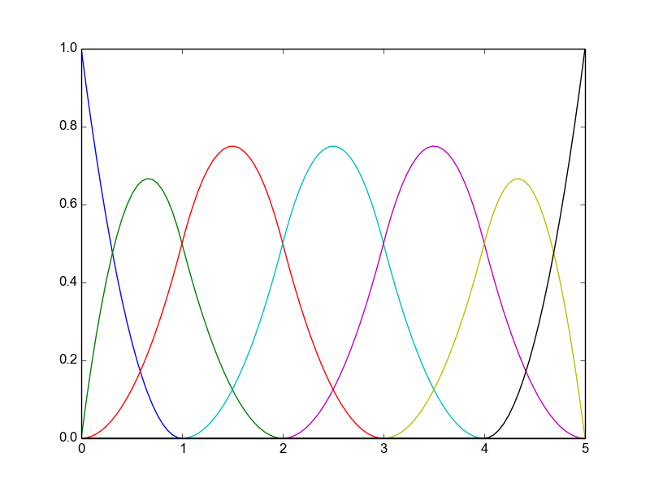
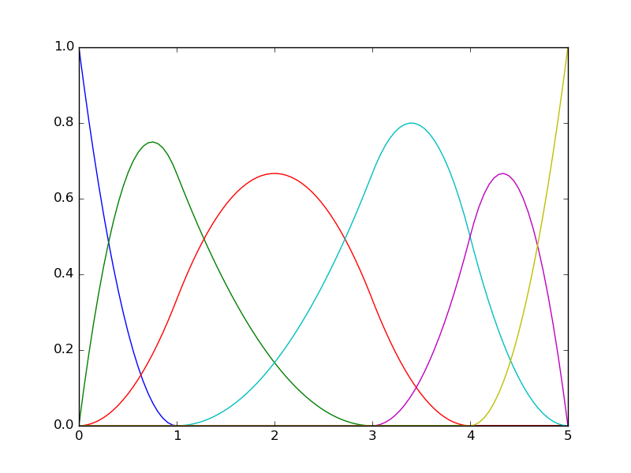
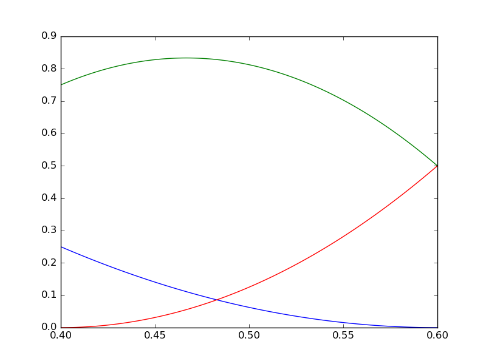
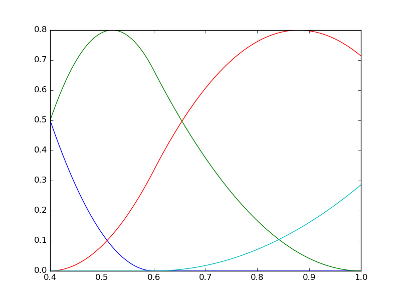
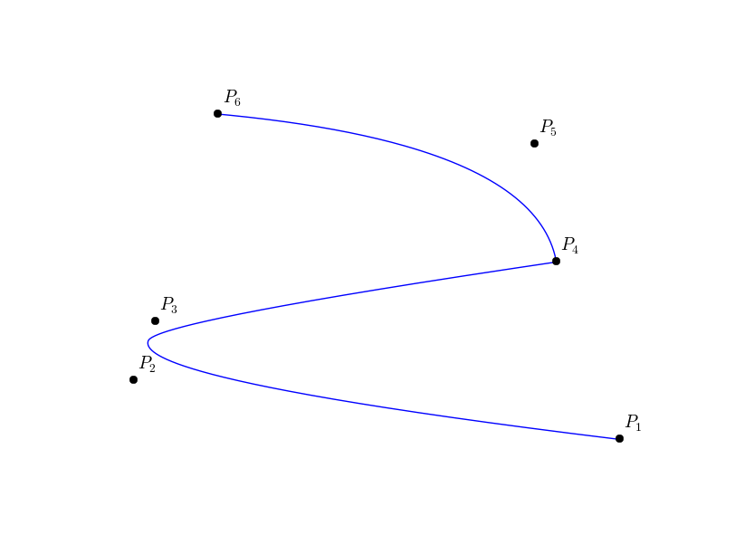
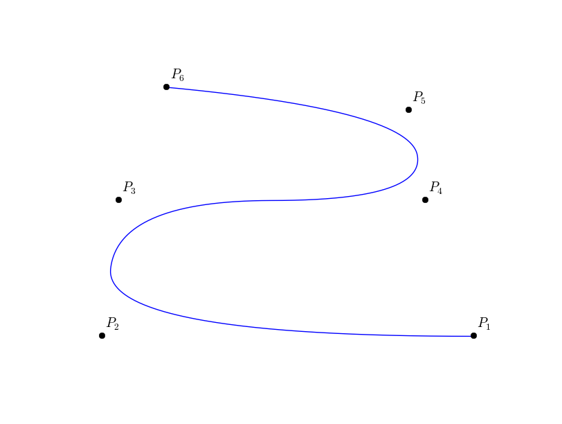

B-Splines and NURBS
*******************

We start this section by recalling some basic properies about B-splines curves and surfaces. We also recall some fundamental algorithms (knot insertion and degree elevation). 

For a basic introduction to the subject, we refer to the books :cite:`piegl` and :cite:`Farin_Book2002`.  

A B-Splines family, :math:`(N_i)_{ 1 \leqslant i \leqslant n}` of order :math:`k`, can be generated using a non-decreasing sequence **of knots** :math:`T=(t_i)_{1\leqslant i \leqslant n + k}`.

B-Splines series
^^^^^^^^^^^^^^^^

The j-th B-Spline of order :math:`k` is defined by the recurrence relation:

.. math::
  
   N_j^k = w_j^k N_j^{k-1} + ( 1 - w_{j+1}^k ) N_{j+1}^{k-1}

where,

.. math::

   w_j^k (x) = \frac{x-t_j}{t_{j+k-1}-t_{j}} \hspace{2cm} N_j^1(x) = \chi_{ \left[ t_j, t_{j+1} \right[ }(x)

for :math:`k \geq 1` and :math:`1 \leq j \leq n`.

We note some important properties of a B-splines basis:

* B-splines are piecewise polynomial of degree :math:`p=k-1`,

* Compact support; the support of :math:`N_j^k` is contained in :math:`\left[ t_j, t_{j+k} \right]` ,

* If :math:`x \in~ ] t_j,t_{j+1} [`, then only the *B-splines* :math:`\{ N_{j-k+1}^k,\cdots,N_{j}^k \}` are non vanishing at :math:`x`,

* Positivity: :math:`\forall j \in \{1,\cdots,n \}~~N_j(x) >0, ~~\forall x \in ] t_j, t_{j+k} [`,

* Partition of unity  :math:`\sum_{i=1}^n N_i^{k}(x) = 1, \forall x \in \mathbb{R}`,

* Local linear independence,

* If a knot :math:`t_i` has a multiplicity :math:`m_i` then the B-spline is :math:`\mathcal{C}^{(p-m_i)}` at :math:`t_i`.

Knots vector families
^^^^^^^^^^^^^^^^^^^^^

There are two kind of **knots vectors**, called **clamped** and **unclamped**. Both families contains **uniform** and **non-uniform** sequences. 

The following are examples of such knots vectors

1. **Clamped knots** (open knots vector)

* uniform

.. math::

  T_1 &= \{0, 0, 0, 1, 2, 3, 4, 5, 5, 5 \}
  \\
  T_2 &= \{-0.2, -0.2, 0.0, 0.2, 0.4, 0.6, 0.8, 0.8 \}

.. image:: ../include/splines/bsplines_t2_p2.png
   :width: 8cm
   :height: 8cm

* non-uniform 

.. math::

  T_3 &= \{0, 0, 0, 1, 3, 4, 5, 5, 5 \}
  \\
  T_4 &= \{-0.2, -0.2, 0.4, 0.6, 0.8, 0.8 \}

2. **Unclamped knots**

* uniform

.. math::

  T_5 &= \{0, 1, 2, 3, 4, 5, 6, 7 \}
  \\
  T_6 &= \{-0.2, 0.0, 0.2, 0.4, 0.6, 0.8, 1.0 \}

.. image:: ../include/splines/bsplines_t5_p2.png
   :width: 8cm
   :height: 8cm

.. image:: ../include/splines/bsplines_t6_p2.png
   :width: 8cm
   :height: 8cm

* non-uniform 

.. math::

  T_7 &= \{0, 0, 3, 4, 7, 8, 9 \}
  \\
  T_8 &= \{-0.2, 0.2, 0.4, 0.6, 1.0, 2.0, 2.5 \}

.. image:: ../include/splines/bsplines_t7_p2.png
   :width: 8cm
   :height: 8cm

B-Spline curve
^^^^^^^^^^^^^^

The B-spline curve in :math:`\mathbb{R}^d` associated to knots vector :math:`T=(t_i)_{1\leqslant i \leqslant n + k}` and the control polygon :math:`(\mathbf{P}_i)_{ 1 \leqslant i \leqslant n}` is defined by :

.. math::

   \mathcal{C}(t) = \sum_{i=1}^n N_i^k(t) \textbf{P}_i

In (Fig. \ref{figBSplineCurve}), we give an example of a quadratic B-Spline curve, and its corresponding knot vector and control points.

.. image:: ../include/splines/basis_fct_p2_N5.png
   :width: 8cm
   :height: 8cm

.. \caption{(left) A quadratic B-Spline curve and its control points using the knot vector :math:`T = \{ 000~  \frac{1}{2}~ \frac{3}{4} \frac{3}{4}~ 1 1 1 \}`, (right) the corresponding B-Splines.}

We have the following properties for a *B-spline* curve:

* If :math:`n=k`, then :math:`\mathcal{C}` is just a B\'ezier-curve,

* :math:`\mathcal{C}` is a piecewise polynomial curve,

* The curve interpolates its extremas if the associated multiplicity of the first and the last knot are maximum (*i.e.* equal to :math:`k`), *i.e.* open knot vector,

* Invariance with respect to affine transformations,

* Strong convex-hull property:

if :math:`t_i \leq t \leq t_{i+1}`, then :math:`\mathcal{C}(t)` is inside the convex-hull associated to the control points :math:`\mathbf{P}_{i-p},\cdots,\mathbf{P}_{i}`,

* Local modification : moving the :math:`i^{th}` control point :math:`\mathbf{P}_{i}` affects :math:`\mathcal{C}(t)`, only in the interval :math:`[t_i,t_{i+k}]`,
* The control polygon approaches the behavior of the curve.

.. note::

   In order to model a singular curve, we can use multiple control points : :math:`\mathbf{P}_{i}=\mathbf{P}_{i+1}`.

Multivariate tensor product splines
^^^^^^^^^^^^^^^^^^^^^^^^^^^^^^^^^^^

Let us consider :math:`d` knot vectors :math:`\mathcal{T} = \{T^1,T^2,\cdots,T^d\}`. For simplicity, we consider that these knot vectors are open, which means that :math:`k` knots on each side are duplicated so that the spline is interpolating on the boundary, and of bounds :math:`0` and :math:`1`. In the sequel we will use the notation :math:`I=[0,1]`.
Each knot vector :math:`T^i`, will generate a basis for a Schoenberg space, :math:`\mathcal{S}_{k_{i}}(T^i,I)`. The tensor product of all these spaces is also a Schoenberg space, namely :math:`\mathcal{S}_{\mathbf{k}}(\mathcal{T})`, where :math:`\mathbf{k}=\{k_1,\cdots,k_d\}`. The cube :math:`\mathcal{P}=I^d=[0,1]^d`, will be referred to as a patch.

The basis for :math:`\mathcal{S}_{\mathbf{k}}(\mathcal{T})` is defined by a tensor product :

.. math::

   N_{\mathbf{i}}^{\mathbf{k}} := N_{i_1}^{k_1} \otimes N_{i_2}^{k_2} \otimes \cdots \otimes N_{i_d}^{k_d}

where, :math:`\mathbf{i}=\{i_1,\cdots , i_d \}`.

A typical cell from :math:`\mathcal{P}` is a cube of the form : :math:`Q_{\mathbf{i}}=[\xi_{i_1}, \xi_{i_1+1}] \otimes \cdots \otimes [\xi_{i_d}, \xi_{i_d+1}]`. 

Deriving a B-spline curve
^^^^^^^^^^^^^^^^^^^^^^^^^

The derivative of a B-spline curve is obtained as:

.. math::

   \mathcal{C}^{\prime}(t) = \sum_{i=1}^{n} {N_{i}^{k}}^{\prime}(t) \mathbf{P}_i = \sum_{i=1}^{n} \left(\frac{p}{t_{i+p}-t_{i}}N_{i}^{k-1}(t) \mathbf{P}_i - \frac{p}{t_{i+1+p}-t_{i+1}}N_{i+1}^{k-1}(t) \mathbf{P}_i \right)
  = \sum_{i=1}^{n-1} {N_{i}^{k-1}}^{\ast}(t) \mathbf{Q}_i

where :math:`\mathbf{Q}_i = p \frac{\mathbf{P}_{i+1} - \mathbf{P}_i}{t_{i+1+p}-t_{i+1}}`, and :math:`\{{N_{i}^{k-1}}^{\ast},~~1 \leq i \leq n-1\}` are generated using the knot vector :math:`T^{\ast}`, which is obtained from :math:`T` by reducing by one the multiplicity of the first and the last knot (in the case of open knot vector), *i.e.* by removing the first and the last knot.

More generally, by introducing the B-splines family :math:`\{ {N_{i}^{k-j}}^{\ast}, 1 \leq i \leq n-j \}` generated by the knots vector :math:`T^{j^{\ast}}` obtained from :math:`T` by removing the first and the last knot :math:`j` times, we have the following result:

proposition
___________

The :math:`j^{th}` derivative of the curve :math:`\mathcal{C}` is given by

.. math::

  \mathcal{C}^{(j)}(t) = \sum_{i=1}^{n-j} {N_{i}^{k-j}}^{\ast}(t) \mathbf{P}_i^{(j)}`
   
where, for :math:`j>0`

.. math::

  \mathbf{P}_i^{(j)} = \frac{p-j+1}{t_{i+p+1}-t_{i+j}} \left( \mathbf{P}_{i+1}^{(j-1)} - \mathbf{P}_i^{(j-1)} \right)
  \\
  \mbox{and} ~ ~ ~ \mathbf{P}_i^{(0)} = \mathbf{P}_i.

By denoting :math:`\mathcal{C}^{\prime}` and :math:`\mathcal{C}^{\prime\prime}` the first and second derivative of the B-spline curve :math:`\mathcal{C}`, it is easy to show that:

We have,

* :math:`\mathcal{C}^{\prime}(0) = \frac{p}{t_{p+2}} \left(\mathbf{P}_{2} - \mathbf{P}_1\right)`,

* :math:`\mathcal{C}^{\prime}(1) = \frac{p}{1-t_{n}} \left(\mathbf{P}_{n} - \mathbf{P}_{n-1}\right)`,

* :math:`\mathcal{C}^{\prime\prime}(0) = \frac{p(p-1)}{t_{p+2}} \left( \frac{1}{t_{p+2}}\mathbf{P}_{1} - \{ \frac{1}{t_{p+2}} + \frac{1}{t_{p+3}} \} \mathbf{P}_2 + \frac{1}{t_{p+3}}\mathbf{P}_{3} \right)`,

* :math:`\mathcal{C}^{\prime\prime}(1) = \frac{p(p-1)}{1-t_{n}} \left( \frac{1}{1-t_{n}}\mathbf{P}_{n} - \{ \frac{1}{1-t_{n}} + \frac{1}{1-t_{n-1}} \} \mathbf{P}_{n-1} + \frac{1}{1-t_{n-1}}\mathbf{P}_{n-2} \right)`.

Example
_______

Let us consider the quadratic B-spline curve associated to the knots vector :math:`T=\{000~\frac{2}{5}~\frac{3}{5}~111 \}` and the control points :math:`\{ P_i, 1 \leq i \leq 5 \}`:

.. math::

   \mathcal{C}(t) = \sum_{i=1}^{5} {N_{i}^{3}}^{\prime}(t) \mathbf{P}_i 

we have, 

.. math::

   \mathcal{C}^{\prime}(t) = \sum_{i=1}^{4} {N_{i}^{2}}^{\ast}(t) \mathbf{Q}_i

where 

.. math::

   \mathbf{Q}_1 = 5 \{\mathbf{P}_{2} - \mathbf{P}_1\}, ~~~~\mathbf{Q}_2 = \frac{10}{3} \{ \mathbf{P}_{3} - \mathbf{P}_2\},
   \\
   \mathbf{Q}_3 = \frac{10}{3} \{ \mathbf{P}_{4} - \mathbf{P}_3\},~~~~\mathbf{Q}_4 = 5 \{\mathbf{P}_{5} - \mathbf{P}_4\}.

The *B-splines* :math:`\{ {N_{i}^{2}}^{\ast},~~1 \leq i \leq 4\}` are associated to the knot vector :math:`T^{\ast}=\{00~\frac{2}{5}~\frac{3}{5}~11 \}`. 

.. rubric:: Fundamental geometric operations

By inserting new knots into the knot vector, we add new control points without changing the shape of the B-Spline curve. This can be done using the DeBoor algorithm :cite:`DeBoor_Book2001`. We can also elevate the degree of the B-Spline family and keep unchanged the curve :cite:`qi`. In (Fig. \ref{refinement_curve_B_Spline}), we apply these algorithms on a quadratic B-Spline curve and we show the position of the new control points.  

Knot insertion
^^^^^^^^^^^^^^

After modification, we denote by :math:`\widetilde{n}, \widetilde{k}, \widetilde{T}` the new parameters. :math:`(\textbf{Q}_i)` are the new control points.

One can insert a new knot :math:`t`, where :math:`t_j \leqslant t < t_{j+1}`. For this purpose we use the DeBoor algorithm :cite:`DeBoor_Book2001`:

.. math::

   \widetilde{n} = n+1
   \\
   \widetilde{k} = k
   \\
   \widetilde{T} = \{ t_1,.., t_j, t, t_{j+1},.., t_{n+k}\}
   \\
   \alpha_i = \left\{\begin{array}{cc}1 & 1 \leqslant i \leqslant j-k+1 \\\frac{t-t_i}{t_{i+k-1}-t_i} & j-k+2 \leqslant i \leqslant j \\0 & j+1 \leqslant i \end{array}\right.
   \\
   \textbf{Q}_i = \alpha_i \textbf{P}_i + (1-\alpha_i) \textbf{P}_{i-1}

Many other algorithms exist, like blossoming for fast insertion algorithm. For more details about this topic, we refer to :cite:`goldman_lyche_book`. 

Order elevation
^^^^^^^^^^^^^^^

We can elevate the order of the basis, without changing the curve. Several algorithms exist for this purpose. We used the one by Huang et al. :cite:`prautzsch`, :cite:`qi`.

A quadratic B-spline curve and its control points. The knot vector is :math:`T = \{ 000, \frac{1}{4}, \frac{1}{2}, \frac{3}{4}, 1 1 1 \}`.

The curve after a h-refinement by inserting the knots :math:`\{ 0.15, 0.35\}` while the degree is kept equal to :math:`2`.

.. image:: ../include/splines/curve_p0_n9.png 
   :width: 8cm
   :height: 8cm

The curve after a p-refinement, the degree was raised by :math:`1` (using cubic B-splines).

.. image:: ../include/splines/curve_p2_n0.png 
   :width: 8cm
   :height: 8cm

The curve after duplicating the multiplicity of the internal knots :math:`\{ \frac{1}{4}, \frac{1}{2}, \frac{3}{4} \}`, 
this leads to a B\'ezier description. We can then, split the curve into :math:`4` pieces (sub-domains), each one will corresponds to a quadratic B\'ezier curve.

.. image:: ../include/splines/curve_p0_n3_bezier.png 
   :width: 8cm
   :height: 8cm

Translation
^^^^^^^^^^^

Rotation
^^^^^^^^

.. todo:: not yet available

Scaling
^^^^^^^

.. todo:: not yet available

.. rubric:: References

.. bibliography:: refs_spline.bib
   :cited:

