New Matrix Assembly for Psydac
------------------------------

Here we keep track on the performance of the new assembly algorithm.
We measure both the discretization time of `BilinearForms` as well as the matrix assembly time of a `DiscreteBilinearForm`
and compare it to the old algorithm. Executing `compare_3d_matrix_assembly_speed.py` will add new data to this file.
This allows us to detect whether any future changes have a positive or negative impact.

Test cases
----------

1. Scaling Analysis \
   We assemble the H1 and Hcurl mass matrices ($\Omega$ is a half hollow torus (analytical mapping), ncells = [32, 32, 32], periodic=[False, False, False]) for varying degrees
   and report the assembly times in Figures.

2. Three specific test cases \
   We report assembly and discretization time for the following test cases \
   2.1 "Q" 
     - $(u, v; F)\mapsto\int_{\Omega}(F\times u)\circ(F\times v)$
     - $u, v, F\in H(curl;\Omega)$, $F$ a "free field"
     - no mapping ($\Omega=(0,1)^3$)
     - ncells = [32, 32, 32], degree = [3, 3, 3], periodic = [False, False, False]
   
   2.2 "weighted $Hdiv$ mass matrix"
     - $(u, v; \gamma)\mapsto\int_{\Omega}u\circ v\ \gamma$
     - $u, v\in H(div;\Omega)$, $\gamma$ an analytic scalar weight function
     - analytical mapping ($\Omega$ a half hollow torus)
     - ncells = [32, 32, 32], degree = [3, 3, 3], periodic = [False, False, False]
      
   2.3 "curl curl"
     - $(u, v)\mapsto\int_{\Omega}(\nabla\times u)\circ(\nabla\times v)$
     - $u, v\in H(curl;\Omega)$
     - Bspline mapping ($\Omega$ a half hollow torus)
     - ncells = [32, 32, 32], degree = [3, 3, 3], periodic = [False, False, False]

3. More variations!
   - $(u, v)\mapsto\int_{\Omega}\nabla u\circ\nabla v$
   - ncells = [16, 8, 32], degree = [2, 4, 3], periodic = [False, True, False]
   - 3.1.1
     - `u, v = elements_of(derham.V0, names='u, v')`
     - no mapping
   - 3.1.2
     - `u, v = elements_of(derham.V0, names='u, v')`
     - analytical mapping
   - 3.1.3
     - `u, v = elements_of(derham.V0, names='u, v')`
     - Bspline mapping
   - 3.2
     - `u, v = elements_of(ScalarFunctionSpace('Vs', domain), names='u, v')`
     - analytical mapping
   - 3.3
     - `u = element_of(derham.V0, name='u')`
     - `v = element_of(ScalarFunctionSpace('Vs', domain), name='v')`
     - analytical mapping
   - `u, v = elements_of(derham.V0, names='u, v')`
   - analytical mapping
   - 3.4
     - additional analytical weight function $\gamma$
   - 3.5
     - additional scalar free field $F\in H^1(\Omega)$
   - 3.6
     - multiplicity vector [1, 3, 2]

Data
----

2025-03-19 16:19:13 (baseline)
----------

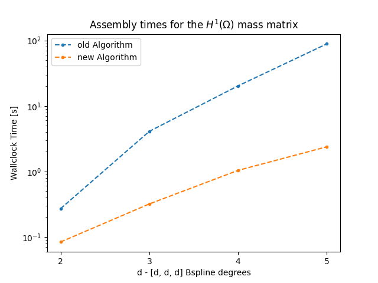

| Test case | old assembly | new assembly | old discretization | new discretization |
| --- | --- | --- | --- | --- |
| 2.1 | 28.224941968917847 | 2.1576409339904785 | 23.585421323776245 | 30.444850206375122 |
| 2.2 | 4.931920051574707 | 0.725954532623291 | 12.519602298736572 | 12.77993392944336 |
| 2.3 | 44.408453702926636 | 4.248292684555054 | 24.583781003952026 | 28.322672605514526 |
| 3.1.1 | 0.23116183280944824 | 0.06337881088256836 | 1.7055208683013916 | 2.4070897102355957 |
| 3.1.2 | 1.0104484558105469 | 0.09787487983703613 | 2.425628185272217 | 3.6106112003326416 |
| 3.1.3 | 0.9545958042144775 | 0.3607370853424072 | 5.0261549949646 | 5.2433154582977295 |
| 3.2 | 1.0606496334075928 | 0.11185073852539062 | 1.6706140041351318 | 3.7393929958343506 |
| 3.3 | 1.0473194122314453 | 0.09792256355285645 | 1.6306214332580566 | 3.327897071838379 |
| 3.4 | 1.0399527549743652 | 0.11473822593688965 | 1.5639660358428955 | 3.353390693664551 |
| 3.5 | 0.9348330497741699 | 0.12152266502380371 | 2.2530579566955566 | 4.756465673446655 |
| 3.6 | 1.013357162475586 | 0.33884382247924805 | 3.090827703475952 | 5.644901752471924 |

2025-03-20 09:57:14 (post first discretization speed up)
----------

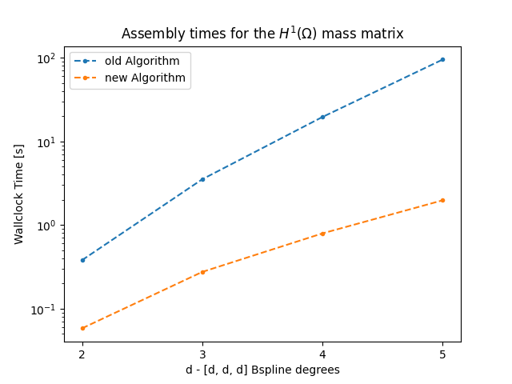

| Test case | old assembly | new assembly | old discretization | new discretization |
| --- | --- | --- | --- | --- |
| 2.1 | 27.988634824752808 | 1.8615539073944092 | 23.975714206695557 | 19.485677242279053 |
| 2.2 | 5.05242133140564 | 0.6173980236053467 | 11.472531080245972 | 7.862813949584961 |
| 2.3 | 44.12760281562805 | 4.010182619094849 | 23.294647455215454 | 18.524545907974243 |
| 3.1.1 | 0.23708844184875488 | 0.07375884056091309 | 1.7830462455749512 | 1.7122766971588135 |
| 3.1.2 | 0.9980983734130859 | 0.0917971134185791 | 2.299697160720825 | 2.204707384109497 |
| 3.1.3 | 1.1703286170959473 | 0.18325209617614746 | 5.208899736404419 | 2.567802906036377 |
| 3.2 | 0.9243614673614502 | 0.0949547290802002 | 1.9204461574554443 | 2.482546806335449 |
| 3.3 | 0.8310558795928955 | 0.1002969741821289 | 1.482534408569336 | 1.9721088409423828 |
| 3.4 | 0.9283547401428223 | 0.097259521484375 | 1.4863159656524658 | 2.015451192855835 |
| 3.5 | 0.9757201671600342 | 0.14624404907226562 | 2.1416451930999756 | 2.58785343170166 |
| 3.6 | 1.259347677230835 | 0.28324031829833984 | 3.146653175354004 | 2.520529270172119 |

2025-03-21 09:19:23 (post messy 20.03. - Discretization speed up was successful!)
----------

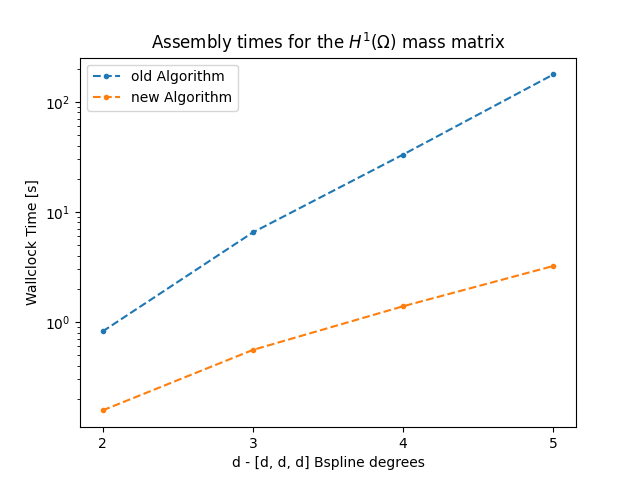

| Test case | old assembly | new assembly | old discretization | new discretization |
| --- | --- | --- | --- | --- |
| 2.1 | 35.13780355453491 | 1.9681012630462646 | 39.280277252197266 | 19.46012854576111 |
| 2.2 | 6.474481105804443 | 0.8134434223175049 | 10.176873683929443 | 8.280707597732544 |
| 2.3 | 47.05171227455139 | 4.088400363922119 | 28.261793613433838 | 21.372082471847534 |
| 3.1.1 | 0.46491122245788574 | 0.05204343795776367 | 1.8174774646759033 | 1.7091984748840332 |
| 3.1.2 | 0.987919807434082 | 0.092132568359375 | 2.6320559978485107 | 2.0457255840301514 |
| 3.1.3 | 1.0088188648223877 | 0.19593191146850586 | 4.784651279449463 | 2.576610565185547 |
| 3.2 | 0.8421344757080078 | 0.08461833000183105 | 1.9112088680267334 | 1.980132818222046 |
| 3.3 | 0.9979250431060791 | 0.09217381477355957 | 1.550412893295288 | 2.448793888092041 |
| 3.4 | 0.8983492851257324 | 0.10183572769165039 | 1.5878078937530518 | 2.2332656383514404 |
| 3.5 | 1.270587682723999 | 0.10780858993530273 | 2.321887731552124 | 2.6907565593719482 |
| 3.6 | 1.2712531089782715 | 0.3087339401245117 | 3.2404658794403076 | 2.610814332962036 |

2025-03-21 16:36:09 (post new import mechanism)
----------

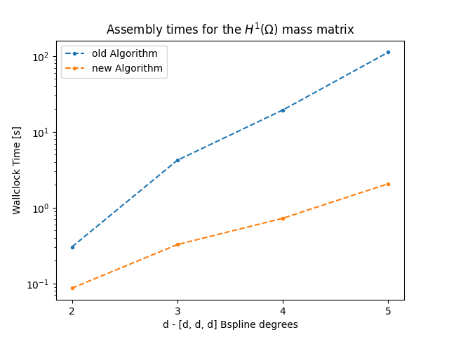

| Test case | old assembly | new assembly | old discretization | new discretization |
| --- | --- | --- | --- | --- |
| 2.1 | 28.021100997924805 | 1.8275749683380127 | 23.66707158088684 | 19.16758680343628 |
| 2.2 | 4.773691177368164 | 0.637488842010498 | 10.840141296386719 | 7.591374158859253 |
| 2.3 | 45.430553674697876 | 4.058728456497192 | 23.76074528694153 | 19.388184070587158 |
| 3.1.1 | 0.22200703620910645 | 0.07474088668823242 | 1.7815592288970947 | 1.5609362125396729 |
| 3.1.2 | 0.9608645439147949 | 0.09184527397155762 | 2.4375054836273193 | 2.1879029273986816 |
| 3.1.3 | 1.0379202365875244 | 0.2266380786895752 | 5.662504434585571 | 2.7675304412841797 |
| 3.2 | 0.9404242038726807 | 0.1183161735534668 | 1.497650146484375 | 2.6354942321777344 |
| 3.3 | 1.2037663459777832 | 0.09836626052856445 | 1.6814558506011963 | 2.3939337730407715 |
| 3.4 | 1.26076078414917 | 0.09230637550354004 | 1.6394295692443848 | 2.199965476989746 |
| 3.5 | 0.998633861541748 | 0.11122441291809082 | 2.24008846282959 | 2.964509963989258 |
| 3.6 | 1.0222725868225098 | 0.31050658226013184 | 3.3156180381774902 | 2.8581044673919678 |

2025-04-04 10:53:30 (two weeks have passed - did we break anything?)
----------

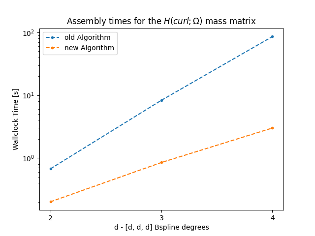

| Test case | old assembly | new assembly | old discretization | new discretization |
| --- | --- | --- | --- | --- |
| 2.1 | 28.142915964126587 | 1.9338326454162598 | 23.385521173477173 | 20.152944564819336 |
| 2.2 | 4.782316446304321 | 0.6241247653961182 | 10.448599100112915 | 7.5199127197265625 |
| 2.3 | 44.60686659812927 | 3.8159379959106445 | 23.421823978424072 | 24.396284103393555 |
| 3.1.1 | 0.24431800842285156 | 0.10341405868530273 | 1.7545700073242188 | 1.8570551872253418 |
| 3.1.2 | 1.0618879795074463 | 0.11340188980102539 | 2.8555710315704346 | 2.616698980331421 |
| 3.1.3 | 1.3046174049377441 | 0.21556401252746582 | 6.202656507492065 | 3.786773443222046 |
| 3.2 | 0.8601498603820801 | 0.11998224258422852 | 1.3641586303710938 | 2.1689112186431885 |
| 3.3 | 0.9261903762817383 | 0.13450884819030762 | 1.3549761772155762 | 2.1967613697052 |
| 3.4 | 0.9098572731018066 | 0.1047065258026123 | 1.3925879001617432 | 2.3136022090911865 |
| 3.5 | 0.8224406242370605 | 0.13000917434692383 | 1.9900181293487549 | 2.7470741271972656 |
| 3.6 | 1.0232231616973877 | 0.34278440475463867 | 2.8048322200775146 | 2.777641773223877 |

2025-04-04 13:55:06 (post first parallel fix attempt - it appears speed up has been achieved, although unlikely, because what should have caused that?)
----------

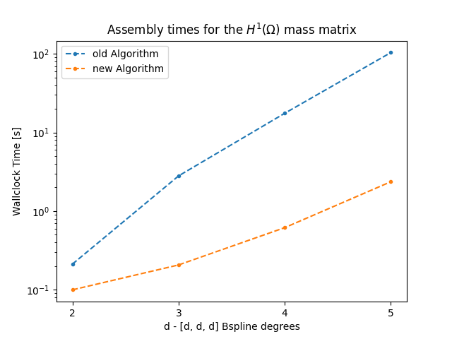

| Test case | old assembly | new assembly | old discretization | new discretization |
| --- | --- | --- | --- | --- |
| 2.1 | 28.180286645889282 | 2.017374277114868 | 21.735363721847534 | 19.58394718170166 |
| 2.2 | 4.775027513504028 | 0.607342004776001 | 8.992727041244507 | 6.345544815063477 |
| 2.3 | 44.412233114242554 | 3.7694337368011475 | 20.201730489730835 | 23.19632077217102 |
| 3.1.1 | 0.23659610748291016 | 0.06298518180847168 | 1.6651525497436523 | 1.3097474575042725 |
| 3.1.2 | 0.6510858535766602 | 0.07380843162536621 | 1.660193681716919 | 1.701888084411621 |
| 3.1.3 | 0.7041728496551514 | 0.1484220027923584 | 3.6196911334991455 | 2.4703898429870605 |
| 3.2 | 0.6496191024780273 | 0.08612775802612305 | 1.0404562950134277 | 1.761687994003296 |
| 3.3 | 0.6505680084228516 | 0.07347488403320312 | 1.0289595127105713 | 1.6952769756317139 |
| 3.4 | 0.654130220413208 | 0.08559274673461914 | 1.08012056350708 | 1.7783985137939453 |
| 3.5 | 0.660348653793335 | 0.10947751998901367 | 1.4325947761535645 | 2.0369203090667725 |
| 3.6 | 0.8111276626586914 | 0.2341163158416748 | 2.2220757007598877 | 2.146054744720459 |

2025-05-30 11:16:29 (two months and several merged PRs later ...)
----------

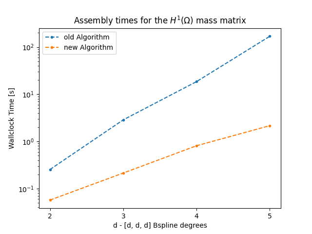
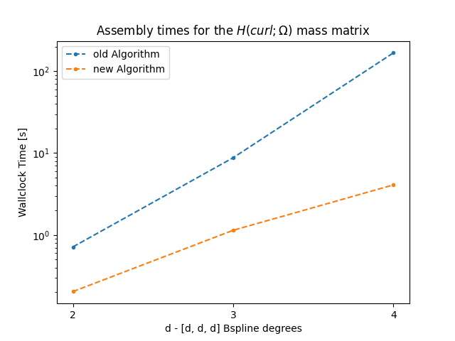

| Test case | old assembly | new assembly | old discretization | new discretization |
| --- | --- | --- | --- | --- |
| 2.1 | 28.694718599319458 | 3.038665294647217 | 23.915484189987183 | 19.930363178253174 |
| 2.2 | 4.886440277099609 | 0.662053108215332 | 9.398367643356323 | 6.656845331192017 |
| 2.3 | 46.22562599182129 | 4.057868957519531 | 21.621031999588013 | 23.057208776474 |
| 3.1.1 | 0.2204422950744629 | 0.04794502258300781 | 1.6827659606933594 | 1.274484395980835 |
| 3.1.2 | 0.6594028472900391 | 0.16877007484436035 | 1.7823209762573242 | 2.5153279304504395 |
| 3.1.3 | 1.0421881675720215 | 0.19957375526428223 | 4.736675977706909 | 3.1552042961120605 |
| 3.2 | 1.0510144233703613 | 0.07971572875976562 | 1.2863450050354004 | 2.2259931564331055 |
| 3.3 | 0.8624687194824219 | 0.09119176864624023 | 1.4721763134002686 | 2.132967710494995 |
| 3.4 | 0.9691996574401855 | 0.0836789608001709 | 1.6891169548034668 | 2.363140821456909 |
| 3.5 | 0.929008960723877 | 0.12714910507202148 | 2.1422152519226074 | 2.7993502616882324 |
| 3.6 | 1.0698661804199219 | 0.3280603885650635 | 4.1496970653533936 | 3.0048136711120605 |

2025-06-16 16:25:14 (figured I did not "run my machine in efficiency mode" during the last benchmark)
----------

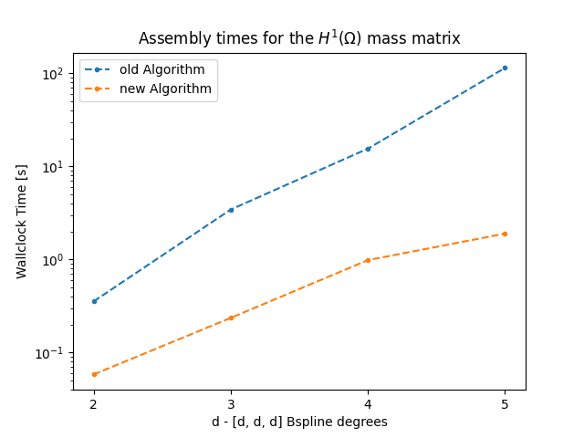
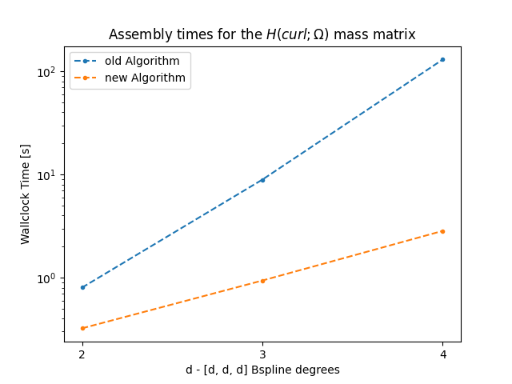

| Test case | old assembly | new assembly | old discretization | new discretization |
| --- | --- | --- | --- | --- |
| 2.1 | 23.0613055229187 | 2.0456459522247314 | 21.107336044311523 | 17.9605610370636 |
| 2.2 | 4.460415363311768 | 0.8379385471343994 | 10.43040680885315 | 7.00338339805603 |
| 2.3 | 36.81690430641174 | 3.4735958576202393 | 21.801087617874146 | 20.9724760055542 |
| 3.1.1 | 0.25452136993408203 | 0.058443307876586914 | 1.8458476066589355 | 1.4133126735687256 |
| 3.1.2 | 0.8308172225952148 | 0.07685112953186035 | 1.8693571090698242 | 1.9513871669769287 |
| 3.1.3 | 1.1787137985229492 | 0.1518993377685547 | 3.9852139949798584 | 2.912513494491577 |
| 3.2 | 0.9296271800994873 | 0.06801486015319824 | 1.4367272853851318 | 1.8134396076202393 |
| 3.3 | 0.789440393447876 | 0.07094025611877441 | 1.114856481552124 | 1.716944694519043 |
| 3.4 | 0.7396600246429443 | 0.06887269020080566 | 1.1906354427337646 | 1.9063026905059814 |
| 3.5 | 0.7099437713623047 | 0.08044672012329102 | 1.545274019241333 | 2.212423324584961 |
| 3.6 | 0.8410937786102295 | 0.25464534759521484 | 2.397289752960205 | 2.2956504821777344 |

2025-06-17 12:21:47
----------

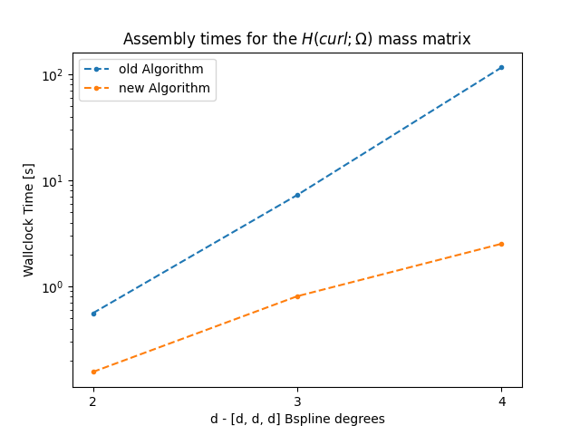

| Test case | old assembly | new assembly | old discretization | new discretization |
| --- | --- | --- | --- | --- |
| 2.1 | 22.33327555656433 | 1.7880897521972656 | 18.185787677764893 | 16.302496433258057 |
| 2.2 | 4.056675672531128 | 0.558434247970581 | 8.840758323669434 | 5.945615291595459 |
| 2.3 | 36.953057527542114 | 3.254056692123413 | 17.54215693473816 | 18.75246000289917 |
| 3.1.1 | 0.27011871337890625 | 0.0413670539855957 | 1.5614757537841797 | 1.370469331741333 |
| 3.1.2 | 0.7860748767852783 | 0.062044382095336914 | 1.9472765922546387 | 1.823927640914917 |
| 3.1.3 | 0.8420484066009521 | 0.22076821327209473 | 4.086768388748169 | 2.468975305557251 |
| 3.2 | 0.9227089881896973 | 0.0693063735961914 | 1.6304991245269775 | 1.7503516674041748 |
| 3.3 | 0.746351957321167 | 0.06600666046142578 | 1.239903211593628 | 1.6380259990692139 |
| 3.4 | 0.7620639801025391 | 0.0733194351196289 | 1.1680026054382324 | 1.8210821151733398 |
| 3.5 | 0.8472707271575928 | 0.08352112770080566 | 1.5843532085418701 | 2.11083722114563 |
| 3.6 | 0.8244407176971436 | 0.2889106273651123 | 2.4265973567962646 | 2.307137966156006 |

2025-06-17 12:42:41 (On Raven (interactive node) with 4 processes)
----------

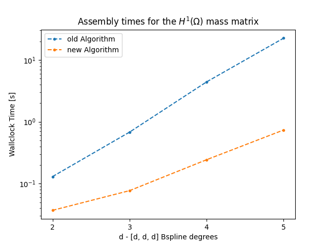
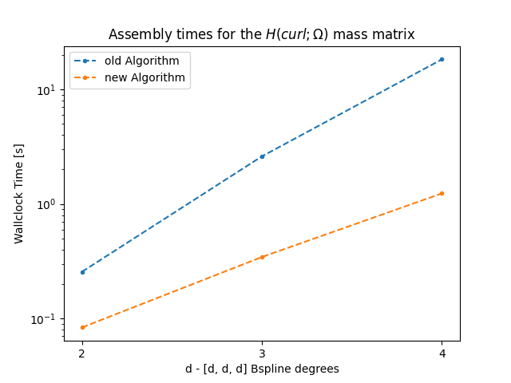

| Test case | old assembly | new assembly | old discretization | new discretization |
| --- | --- | --- | --- | --- |
| 2.1 | 4.966858386993408 | 0.933060884475708 | 27.306098699569702 | 23.320034742355347 |
| 2.2 | 1.399003267288208 | 0.2367708683013916 | 11.697659730911255 | 8.695177555084229 |
| 2.3 | 12.866767644882202 | 1.4174602031707764 | 27.85459852218628 | 25.848977088928223 |
| 3.1.1 | 0.09269475936889648 | 0.022661924362182617 | 2.303361177444458 | 1.8651676177978516 |
| 3.1.2 | 0.27165651321411133 | 0.043382883071899414 | 2.464747428894043 | 3.227069139480591 |
| 3.1.3 | 0.29349470138549805 | 0.07746481895446777 | 6.343784809112549 | 3.8287014961242676 |
| 3.2 | 0.2693343162536621 | 0.04123950004577637 | 1.9163696765899658 | 3.19993257522583 |
| 3.3 | 0.27109217643737793 | 0.0441288948059082 | 1.9247958660125732 | 3.187912702560425 |
| 3.4 | 0.261120080947876 | 0.0287020206451416 | 1.9772615432739258 | 3.9817683696746826 |
| 3.5 | 0.2802116870880127 | 0.03484058380126953 | 2.5496952533721924 | 3.7189102172851562 |
| 3.6 | 0.3057436943054199 | 0.11693048477172852 | 4.059762954711914 | 3.763354778289795 |

2025-06-17 13:02:53 (On Raven with 16 processes)
----------

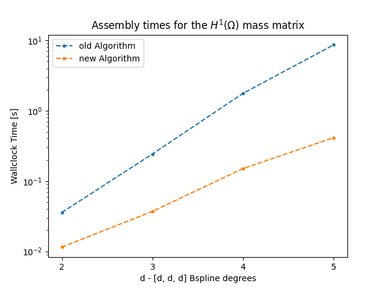

| Test case | old assembly | new assembly | old discretization | new discretization |
| --- | --- | --- | --- | --- |
| 2.1 | 1.9086198806762695 | 0.4414858818054199 | 38.403902769088745 | 31.820643663406372 |
| 2.2 | 0.5662803649902344 | 0.12762975692749023 | 16.70490837097168 | 11.710942268371582 |
| 2.3 | 4.949585437774658 | 0.5964908599853516 | 38.70210146903992 | 35.087459325790405 |
| 3.1.1 | 0.03520607948303223 | 0.011145353317260742 | 3.1359453201293945 | 2.5555508136749268 |
| 3.1.2 | 0.07205629348754883 | 0.014765262603759766 | 3.2755184173583984 | 3.2826507091522217 |
| 3.1.3 | 0.08732223510742188 | 0.025731325149536133 | 6.4914350509643555 | 3.848024606704712 |
| 3.2 | 0.07957053184509277 | 0.014905452728271484 | 1.9195804595947266 | 3.231506586074829 |
| 3.3 | 0.08603405952453613 | 0.014133930206298828 | 1.9270360469818115 | 3.165761947631836 |
| 3.4 | 0.07611703872680664 | 0.013871431350708008 | 1.9784696102142334 | 3.9492123126983643 |
| 3.5 | 0.08229851722717285 | 0.018306255340576172 | 2.5339157581329346 | 3.7553234100341797 |
| 3.6 | 0.10729360580444336 | 0.06099987030029297 | 4.036512136459351 | 3.8180510997772217 |

2025-06-17 15:04:09 (DON'T compare to other timings in this file! Temporarily increased amount of spline cells ([32, 32, 32]->[64, 64, 64]), and gathered data on Raven using 72 processes)
----------

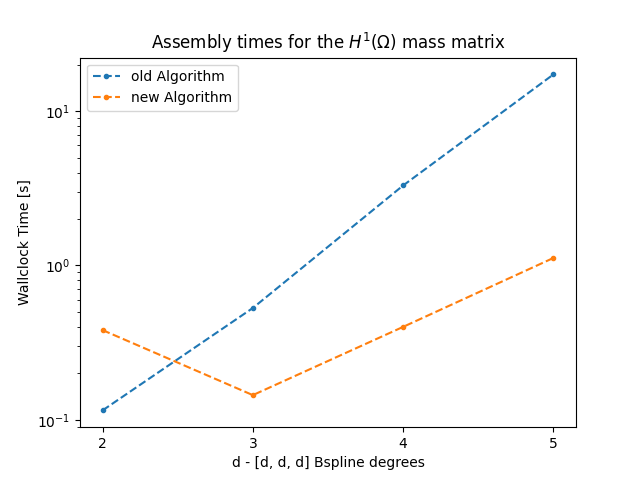
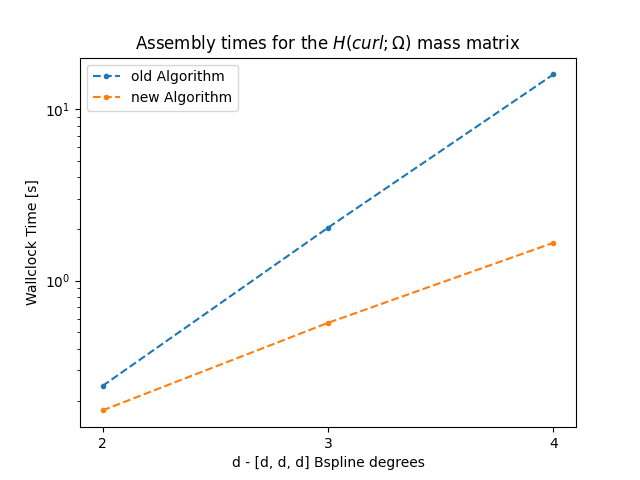

| Test case | old assembly | new assembly | old discretization | new discretization |
| --- | --- | --- | --- | --- |
| 2.1 | 0.6231644153594971 | 0.24467229843139648 | 38.22771883010864 | 32.24928593635559 |
| 2.2 | 0.20003247261047363 | 0.07593297958374023 | 16.67274498939514 | 11.648281574249268 |
| 2.3 | 1.575169563293457 | 0.3761000633239746 | 37.97667694091797 | 35.66774272918701 |
| 3.1.1 | 0.028136491775512695 | 0.01233816146850586 | 3.1667587757110596 | 2.5606954097747803 |
| 3.1.2 | 0.05773735046386719 | 0.01934671401977539 | 3.2855639457702637 | 3.3297417163848877 |
| 3.1.3 | 0.07018470764160156 | 0.046843767166137695 | 6.432265996932983 | 3.9099390506744385 |
| 3.2 | 0.040268898010253906 | 0.016238689422607422 | 1.9157161712646484 | 3.2188096046447754 |
| 3.3 | 0.05425262451171875 | 0.03821516036987305 | 1.9021687507629395 | 3.1850879192352295 |
| 3.4 | 0.07127165794372559 | 0.02425527572631836 | 1.9942419528961182 | 4.052478790283203 |
| 3.5 | 0.05399012565612793 | 0.052900075912475586 | 2.5788321495056152 | 3.7331326007843018 |
| 3.6 | 0.06781840324401855 | 0.04643893241882324 | 3.868757963180542 | 3.8041274547576904 |

2025-07-08 10:49:55 (possible discretization speed up due to test_trial array pyccelization)
----------

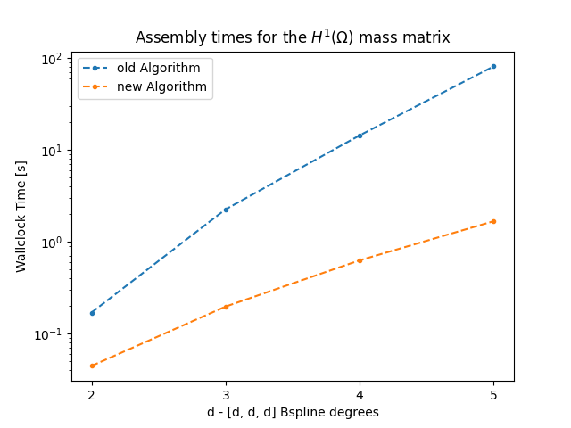

| Test case | old assembly | new assembly | old discretization | new discretization |
| --- | --- | --- | --- | --- |
| 2.1 | 21.394362211227417 | 1.6222810745239258 | 17.41140651702881 | 17.047351598739624 |
| 2.2 | 4.535985708236694 | 0.6825118064880371 | 8.166927576065063 | 6.768099546432495 |
| 2.3 | 35.77719712257385 | 3.055466651916504 | 17.07978916168213 | 19.49526357650757 |
| 3.1.1 | 0.223785400390625 | 0.05041623115539551 | 1.4842898845672607 | 1.5440177917480469 |
| 3.1.2 | 0.7153589725494385 | 0.07961869239807129 | 1.727273941040039 | 1.9723243713378906 |
| 3.1.3 | 0.9888041019439697 | 0.294403076171875 | 4.156922340393066 | 2.284538507461548 |
| 3.2 | 0.7195453643798828 | 0.07235383987426758 | 1.2490220069885254 | 1.847059726715088 |
| 3.3 | 0.833402156829834 | 0.06942892074584961 | 1.0294239521026611 | 1.8674139976501465 |
| 3.4 | 0.8275783061981201 | 0.07140064239501953 | 1.257390022277832 | 2.0434205532073975 |
| 3.5 | 0.8191125392913818 | 0.10290336608886719 | 1.492846965789795 | 2.155611515045166 |
| 3.6 | 0.816279411315918 | 0.26879048347473145 | 2.204167604446411 | 2.4388020038604736 |

2025-07-08 15:43:55 (final benchmark prior to review)
----------

| Test case | old assembly | new assembly | old discretization | new discretization |
| --- | --- | --- | --- | --- |
| 2.1 | 21.75644016265869 | 1.6119256019592285 | 15.705687761306763 | 15.856929540634155 |
| 2.2 | 3.935366630554199 | 0.5126712322235107 | 6.583062410354614 | 5.4197447299957275 |
| 2.3 | 35.676289319992065 | 3.3047707080841064 | 15.980939626693726 | 17.636327266693115 |
| 3.1.1 | 0.18618035316467285 | 0.032674312591552734 | 1.2157981395721436 | 1.3658058643341064 |
| 3.1.2 | 0.5384716987609863 | 0.04995560646057129 | 1.2744600772857666 | 2.213038444519043 |
| 3.1.3 | 0.59226393699646 | 0.1124105453491211 | 2.7008297443389893 | 1.8426353931427002 |
| 3.2 | 0.5325953960418701 | 0.0496373176574707 | 0.7748997211456299 | 1.5689377784729004 |
| 3.3 | 0.5329554080963135 | 0.04779481887817383 | 0.7811164855957031 | 1.5893547534942627 |
| 3.4 | 0.5326511859893799 | 0.04914593696594238 | 0.7998702526092529 | 1.6563560962677002 |
| 3.5 | 0.5393447875976562 | 0.0582118034362793 | 1.054741621017456 | 1.7725679874420166 |
| 3.6 | 0.6015224456787109 | 0.18850183486938477 | 1.6259655952453613 | 2.1859922409057617 |

